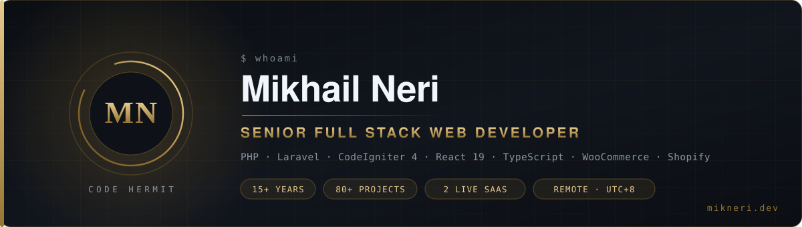

<div align="center">
  
</div>

<div align="center">

[](https://mikneri.dev)
[](https://www.linkedin.com/in/mikneri/)
[](mailto:me@mikneri.dev)
[](https://mikneri.dev/assets/uploads/files/Mikhail-Neri-CV.pdf)


</div>

---

## 👋 whoami

Senior full stack web developer, 15+ years shipping production software, working remote from the Philippines for teams in the US, UK, Netherlands, France, Norway, Australia and the UAE.

I build from a blank file. PHP and Laravel on the server, React 19 and TypeScript on the client, and everything in between: multi tenant SaaS, headless ecommerce, hardened REST APIs, WordPress and WooCommerce internals, Shopify Liquid storefronts.

I have architected and shipped a three application headless commerce platform solo, written 90+ custom plugins, and I run my own SaaS products in production, which means I own uptime, billing, migrations and support, not just the pull request.

I use AI tooling the way I use an IDE or a linter. I read, test and understand every line before it ships.

<br>

## 🧰 Stack

**Languages**


**Backend**


**Frontend**


**Commerce and CMS**


**Payments**


**Data, infra and quality**


<br>

## 📊 Depth, not a keyword list

| Technology | Years | Where it shows up |
| :--- | :---: | :--- |
| PHP | 15+ | Every backend I build |
| MySQL and MariaDB | 15+ | Every data layer I own |
| WordPress | 12+ | Custom themes, plugin architecture, migrations |
| REST APIs | 10+ | API services, storefront bridges, integrations |
| CodeIgniter 4 | 8+ | Headless commerce admin, Lokalista, internal ops platform |
| WooCommerce | 8+ | Cart bridge, POS sync, role based pricing, HPOS |
| Shopify Liquid | 4+ | Storefront theme work and Admin API sync |
| Webflow | 4+ | Marketing sites and CMS builds |
| React and TypeScript | 2+ | React 19 storefront, two React 19 SPAs in production |
| Laravel | Current | RollCall API, PrepBenchmark on Laravel 12 and Filament |

<br>

## 🚀 Products I build and run

| Product | Status | Stack | What it does |
| :--- | :--- | :--- | :--- |
| **[StoqShelf](https://stoqshelf.com)** | Live SaaS | CodeIgniter · MySQL · Bootstrap | Inventory and stock management for small and medium businesses. Live stock tracking, catalogues, reporting. Idea to production, built independently. |
| **[Transiently](https://transiently.net)** | Live | PHP · JavaScript · MySQL | Hotel management SaaS written from scratch with no framework. Reservations, check in and checkout, automated guest folio billing, sales reporting. |
| **[Lokalista](https://lokalista.app)** | Live | React · TypeScript · Leaflet · CodeIgniter 4 | Local business discovery for the Philippines. React TypeScript SPA with AI smart search, interactive maps, QR digital menus, owner dashboards over a CI4 REST API. |
| **[PrepBenchmark](https://prepbenchmark.com)** | Live | Laravel 12 · Filament | Finance exam preparation platform. |
| **[RollCall](https://rollcallhq.xyz)** | Launching | Laravel 13 · React 19 · Sanctum | Multi tenant BJJ gym membership and attendance SaaS. QR check in, belt progression, dues with reconciliation and dunning, member chat, family accounts. pnpm monorepo with a shared Zod typed contract. |
| **Internal Team Ops Platform** | Live, private | CodeIgniter 4 · Shield · MariaDB | Kanban projects, team calendar, worker owned time tracking, broadcasts, encrypted vault, cron alerts to email and Telegram. Built solo. |

<br>

## 🏗️ Selected engineering work

<table>
<tr>
<td width="50%" valign="top">

### 🛒 Headless commerce platform
**Sole architect and developer · NDA**

Three independently deployable applications over one shared database contract: a CodeIgniter 4 admin, a hardened standalone REST API, and a React 19 TypeScript storefront on TanStack Start.

`28 feature phases` `55+ controllers` `34 migrations` `56 API routes` `3 gateways`

Catalog and variations, tax and VAT engine, shipping zones, loyalty and gift cards, refunds and returns, abandoned cart recovery, affiliate tracking, Stripe subscriptions, i18n with DeepL. API key and Bearer auth, CSRF, rate limiting, zero downtime deploys.

</td>
<td width="50%" valign="top">

### 🔗 WooCommerce cart bridge
**UK DTC retailer · source only plugin**

A Web Component drawer cart intercepts native cart and checkout, maps local products to a partner store by post meta, and creates a real pending order over the stock WC REST API, authenticated with an Application Password encrypted at rest with AES 256 GCM.

`108 PHPUnit tests` `PHPStan level 6` `full WP CLI parity`

Four checkout strategies, mobile first three tier responsive drawer with dark mode.

</td>
</tr>
<tr>
<td width="50%" valign="top">

### 🏭 Multi warehouse fulfilment
**WooCommerce extension**

Geocodes the shipping address at checkout, measures distance to every active warehouse, checks live stock, and assigns the closest warehouse that can actually fulfil. Reserves stock per warehouse so two concurrent orders cannot claim the same unit, with a surcharge fallback when no single site holds everything. HPOS compatible.

Removed the manual warehouse pick and stopped oversells during concurrent checkout.

</td>
<td width="50%" valign="top">

### 🛡️ Payment processor readiness
**High risk DTC client · EU compliance · NDA**

Took a store from a failing processor readiness audit to submission ready. An 18 point requirement checklist closed in code, six GDPR and EU distance selling policy pages rendered dynamically from business settings, a consent gate, and a native pay by bank gateway built from scratch with HMAC signed webhooks alongside Stripe, Mollie and Viva Wallet.

</td>
</tr>
</table>

<br>

## 🗓️ Track record

```text
2012 → now   Freelance Senior Full Stack Developer, remote
             US · UK · NL · FR · NO · AU · UAE  ·  80+ projects  ·  90+ custom plugins

2022         Gravitate One, Utah            20+ production sites, WordPress · Shopify · Webflow
2019 → 2023  Rennie West, Long Beach CA     WordPress engineering and technical SEO, three year engagement
2019 → 2021  Derek Devlin, UK               Web development, competitor and keyword research
2018 → 2019  The IncomeStore, Illinois      Content platform builds at scale
2017 → 2018  Sequent Systems, San Francisco Lease management app, POS, DTR and accounting systems
2016 → 2017  UmbrellaSupport, London        Custom PHP and WordPress for UK compliance requirements
2010         Oroport Cargohandling          IT specialist, where it all started
```

<br>

## 🎓 Education and training

`2015` International Diploma in IT, major in Web Development · Informatics Computer Institute
`2024` WooCommerce development: custom extensions, HPOS, REST integration
`2023` CodeIgniter 4 migration and architecture · production CI3 to CI4 rebuilds
`2022` Shopify theme development and Liquid
`2021` Webflow CMS and interactions
`2019` REST API design and integration
`2018` WordPress advanced development · MySQL and database architecture

<br>

## 📈 GitHub

<div align="center">


</div>

> Most of my client work sits in private repositories under NDA, so the graph above is a floor, not a ceiling.

<br>

## 🤝 What I am looking for

Senior full stack or backend roles, remote, permanent or long term contract. Product teams that ship.

| | |
| :--- | :--- |
| 🌍 **Availability** | Remote worldwide, open now |
| 🕗 **Overlap** | UTC+8. Full European business hours, mornings with Australia and the Gulf, evenings with US Pacific |
| 💼 **Also open to** | Agency white label work, retainers, and project builds |
| 📄 **CV** | [Mikhail-Neri-CV.pdf](https://mikneri.dev/assets/uploads/files/Mikhail-Neri-CV.pdf) |
| 📬 **Reach me** | [me@mikneri.dev](mailto:me@mikneri.dev) · [mikneri.dev/contact](https://mikneri.dev/contact) · [LinkedIn](https://www.linkedin.com/in/mikneri/) |

<div align="center">
<br>
<sub><b>The Code Hermit</b> · direct ownership, clean code, no agency overhead · <a href="https://mikneri.dev">mikneri.dev</a></sub>
</div>
